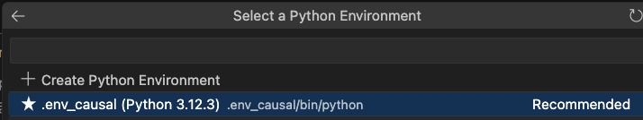

# Causal Analysis for Software Engineering


## Use Cases

The primary focus is on answering causal queries of interest related to LLMs. It enables ML researchers in software engineering to explain the causal effect of a set of confounders associated with the treatment input prompt. Some of the use cases include:

### Code Auto-Completion:
Galeras can be used to evaluate LLM's performance in auto-completing code. Its provided non-contaminated code snippets can be used with our random cut implementation to randomly cut the code snippet somewhere after the code signature.


### Code Generation
ML researchers have the opportunity to evaluate LLM's proficiency in producing test cases using Galeras. The benchmark provides a dedicated dataset tailored for test generation purposes, enabling a comprehensive assessment and interpretation of code generation performance.

## Environment setup
You will need to install the necessary python packages todo the causal analysis using dowhy and following the stages for do_code.

It is recommended that you create and work within a virtual environment to avoid package conflicts in your machine. Herre we recommend two options: A python virual environment or a docker container.

### Option1: Python virtual environment

Install the virtual environment package using ```pip install virtaulenv```

```
python3 -m venv .env_causal
```

Activate your environment depending on you system:
- Windows: ```.env_causal\Scripts\activate```
- Unix or MacOS ``` source .env_causal/bin/activate```

### Packages

### Testbed Generation and Curation:

You can install all the packages in a Python environment using

```
pip install -r requirements.txt
```
## Running the python notebook at VS Code

## Analysis Approach


## Evaluation


## Conclusion

 By focusing on causal queries and considering a wide range of confounding features, Galeras enables ML researchers in SE to evaluate and interpret the code generation capabilities of LLMs. The benchmark dataset and testbeds facilitate transparent and interpretable evaluations, addressing the limitations of relying solely on accuracy metrics.


[def]: https://github.com/WM-SEMERU/chat-gpt-failures/blob/update_readme/figures/approach/galeras-pipeline.pdf